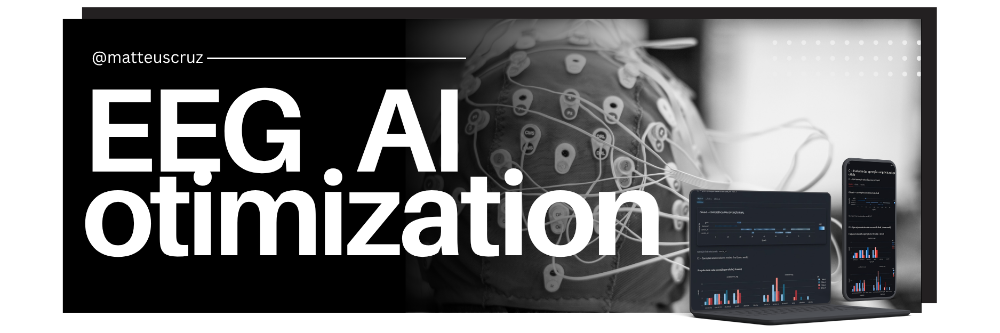

## Hi, I'm Mateus Cruz

Ph.D. Candidate in Electrical & Telecommunications Engineering | AI Researcher | Software Developer

I am a Ph.D. candidate at two Brazilian research institutions. At the **Instituto Nacional de Telecomunicações (INATEL)**, my research focuses on the **decentralization of learning through Federated Learning and Blockchain**, investigating how distributed and trustless architectures can enable privacy-preserving, collaborative AI systems. At the **Universidade Federal de Itajubá (UNIFEI)**, my work centers on the **design and optimization of Deep Learning models for deployment on embedded devices and microcontrollers**, bridging the gap between state-of-the-art AI and resource-constrained hardware.

My background spans **Computer Science, Telecommunications, and Data Science**, providing a multidisciplinary foundation for developing AI-driven solutions at the intersection of **Edge AI, IoT, and distributed intelligence**.

## Main Projects

## 🛠️ Technology Stack

<table>
  <tr>
    <td align="center" width="180">
      <strong>AI & Agents</strong>
    </td>
    <td>
      
      
      
      
      
      
      
      
      
      
      
      
      
      
    </td>
  </tr>
  <tr>
    <td align="center">
      <strong>Backend & Cloud</strong>
    </td>
    <td>
      
      
      
      
      
      
    </td>
  </tr>
  <tr>
    <td align="center">
      <strong>Data Eng & MLOps</strong>
    </td>
    <td>
      
      
      
      
      
      
      
      
      
      
    </td>
  </tr>
</table>

## 

<table>
  <tr>
    <td><small>📄 <em>Advances in the Use of rPPG for Non-Invasive Heart Rate Estimation</em> SBrT, 2025</small></td>
    <td><small>📄 <em>Brain Tumor Detection Using YOLOv11 on Edge Computing for Decision Support</em> ACDSA, 2025</small></td>
  </tr>
  <tr>
    <td><small>📄 <em>Enhancing Healthcare Through Collaborative Intelligence: a Federated Learning Case Study</em> IEEE LASCAS, 2025</small></td>
    <td><small>📄 <em>A Federated Learning-based Solution for Pneumonia Diagnosis in Remote and Low-Income Areas</em> SBrT, 2024</small></td>
  </tr>
  <tr>
    <td><small>📄 <em>Brain Tumor Images Class-Based and Prompt-Based Detectors and Segmenter: Performance Evaluation of YOLO, SAM and Grounding DINO</em> ICoABCD, 2024</small></td>
    <td><small>📄 <em>Pick and Place em Tempo Real Usando Visão Computacional com YOLOv8 e Staubli TS60</em> SBrT, 2024</small></td>
  </tr>
  <tr>
    <td><small>📄 <em>Application of YOLOv7 for Real-Time Detection of Aedes Aegypti</em> SBrT, 2023</small></td>
    <td><small>📄 <em>A Multi-Faceted Approach to Maritime Security: Federated Learning, Computer Vision, and IoT in Edge Computing</em> SBrT, 2023</small></td>
  </tr>
  <tr>
    <td><small>📄 <em>Evaluating Computer Vision Architectures for Ship Classification: A Comparative Study</em> SBrT, 2023</small></td>
    <td><small>📄 <em>Smart Farming with Computer Vision: Detecting Diseases in Strawberry Crops via Mobile Applications</em> SBrT, 2023</small></td>
  </tr>
  <tr>
    <td><small>📄 <em>Design, Deployment, and Validation of a Low-Cost IoT Platform based on LoRa for Precision Dairy Farming</em> SBrT, 2023</small></td>
    <td><small>📄 <em>Vehicle and Plate Detection for Intelligent Transport Systems: Performance Evaluation of Models YOLOv5 and YOLOv8</em> IEEE ICOCO, 2023</small></td>
  </tr>
  <tr>
    <td><small>📄 <em>An IoT Crop Recommendation System with k-NN and LoRa for Precision Farming</em> SBrT, 2022</small></td>
    <td><small>📄 <em>Design, Application, and Validation of an IoT Wireless Sensor Network based on LoRa for Strawberry Farming</em> SBrT, 2022</small></td>
  </tr>
  <tr>
    <td><small>📄 <em>Smart Strawberry Farming Using Edge Computing and IoT</em> SENSORS, 2022</small></td>
    <td></td>
  </tr>
</table>
